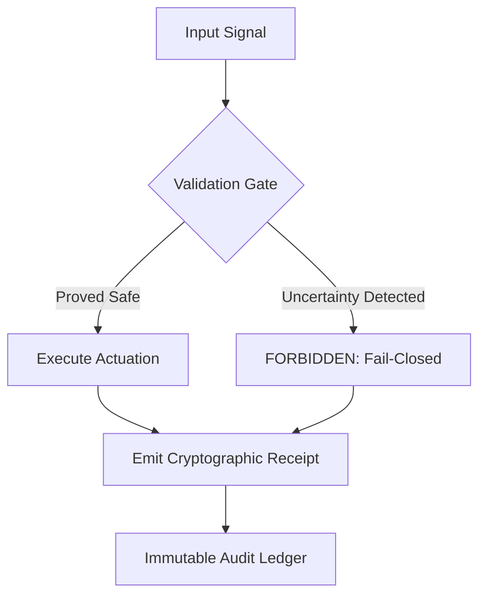

# Vetos Systems: Engineering & Reliability Portfolio


A collection of structural engineering artifacts, autonomous systems architecture, and deterministic governance frameworks.

---

## Reliability Philosophy

This repository is a working record of how high-consequence systems are designed to fail safely instead of failing silently.

In this context, three invariants are treated as non-negotiable:

1. **Fail-closed by default:** if confidence or validity checks fail, the system halts instead of acting.
2. **Auditable lineage:** material transformations emit receipts that can be replayed or verified.
3. **Epistemic modesty:** systems are expected to refuse action when uncertainty is unresolved.



---

## Repository Layout

### Core portfolio areas

- `work-samples/` — implementation-focused examples (governance stack, text-scalpel, locality experiments).
- `tools/` — executable analysis and control utilities (funding analysis, structural integrity audit, geospatial discovery, coordination).
- `ai-failure-gates/` — explicit fail-closed gate implementations and symbolic/coverage governors.
- `audits/` — written audit frameworks, failure taxonomies, and case analyses.
- `probes/` — targeted probes for API behavior, enterprise billing, context nonlinearity, and cost surfaces.
- `artifacts/` — epistemic instrumentation and document-gate components.
- `visualizations/` — concept maps and explanatory writeups.

### Notable implementations

- `tools/structural-integrity-audit/macro_engine_v2.1.py`  
  Macro regime and liquidity monitoring with volatility-aware veto triggers.
- `work-samples/core-governance-stack/guardrail_engine.py`  
  Confidence-gated refusal layer for low-certainty inference.
- `work-samples/core-governance-stack/audit_pipeline.py`  
  SQLite-backed audit lineage with cryptographic receipts.
- `ai-failure-gates/fail_closed_gate/gate.py`  
  Minimal fail-closed gate logic used for controlled rejection behavior.
- `tools/funding-analysis/audit_pipeline.py`  
  Deterministic funding record checks used by the make-based smoke test.

---

## Quick Start

### 1) Install dependencies

```bash
make install
```

### 2) Run repository smoke tests

```bash
make test
```

What `make test` currently does:

- Compiles the repository (`python -m compileall -q .`).
- Runs `work-samples/failure_oracle.py`.
- Runs an inline import-and-execute check for `tools/funding-analysis/audit_pipeline.py`.

### 3) Run the funding extraction utility

```bash
make run
```

---

## Scope and Intent

This repository is designed as an engineering portfolio, not a single deployable product. Most directories are independent prototypes, controls, or analyses that can be run on their own.

If you are evaluating this codebase, start with:

1. `work-samples/core-governance-stack/README.md`
2. `tools/structural-integrity-audit/README.md`
3. `ai-failure-gates/README.md`

These provide the clearest picture of implementation quality, safety posture, and operational assumptions.

---

Maintained by Josh Vetos | 2026
