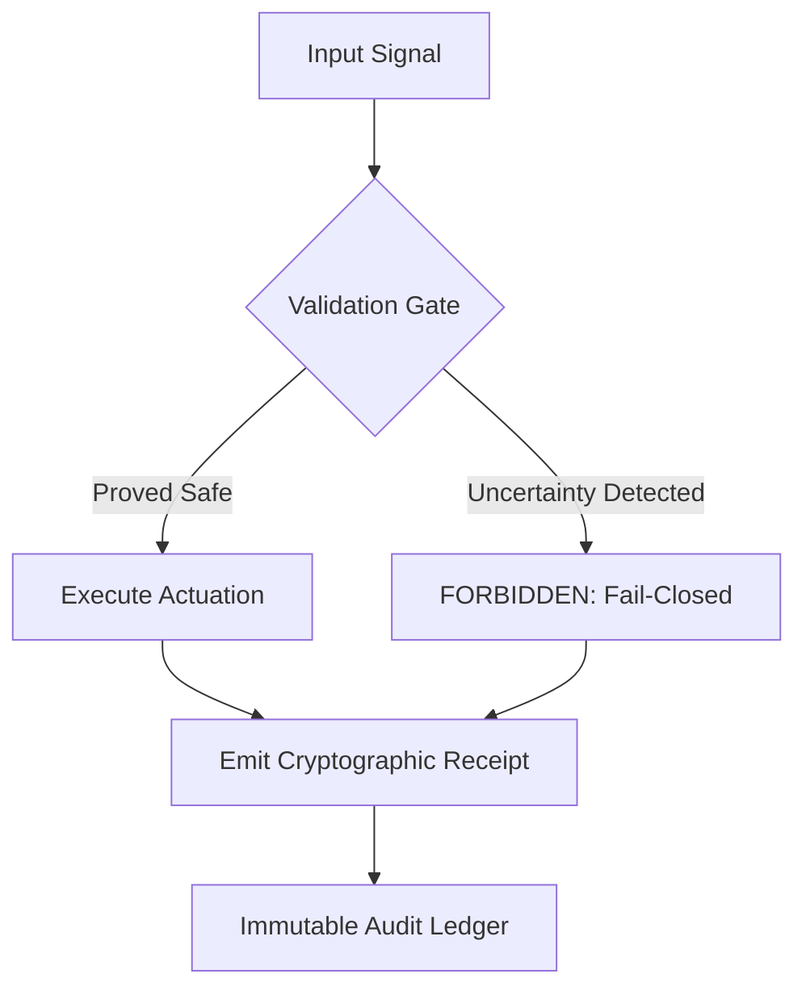

# Vetos Systems: Engineering & Reliability Portfolio

**A collection of structural engineering artifacts, autonomous systems architecture, and deterministic governance frameworks.**

---

## Philosophy: Reliability Over Appearance

This repository serves as a living record of technical competency. It documents how complex systems—from industrial automation to macro-financial engines—are audited, constrained, and forced into a safe state when certainty is insufficient.

In high-consequence environments, failure is not just a bug; it is a structural risk. This portfolio is built on three non-negotiable invariants:

1. **Fail-Closed by Design:** Systems must move to a safe state (Halt) rather than degrading silently or hallucinating.
2. **Auditable Lineage:** Every significant actuation or data transformation must emit a cryptographically verifiable receipt.
3. **Epistemic Modesty:** If a system cannot prove its input is valid or its confidence is sufficient, it is forbidden from acting.

---

## Featured Engineering Artifacts

### 1. Macro Regime Detection & Risk Monitoring

**Location:** `tools/structural-integrity-audit/macro_engine_v2.1.py`
An institutional-grade risk engine that integrates macroeconomic indicators with advanced statistical modeling.

* **Conditional Volatility:** Implements GARCH(1,1) to identify variance clustering and structural regime shifts.
* **Liquidity Monitoring:** Tracks "Net Liquidity" (Fed Assets - TGA - RRP) to identify systemic drawdowns with 2-4 week lead times.
* **Quarantine Logic:** Automatically triggers a "Veto" on rebalancing when liquidity drains or volatility spikes above predicted surfaces.

### 2. Core Governance & Reliability Stack

**Location:** `work-samples/core-governance-stack/`
Concrete implementations of safety layers for autonomous and industrial systems.

* **`guardrail_engine.py`**: Probabilistic refusal layer using Softmax confidence thresholds to block low-certainty AI inference.
* **`audit_pipeline.py`**: SQLite-backed ledger providing immutable data lineage and cryptographic receipts for ETL processes.
* **`concur_guard.py`**: Deterministic financial gating using hash-chained ledgers to prevent unauthorized or duplicate transactions.
* **`industrial_guard.py`**: Deterministic state machine for predictive maintenance and safety enclosures in industrial OT (Operational Technology).
* **`stress_cycle_v3.py`**: Full-cycle mechanism design testing for risk allocation kernels.

---

## Operating Standard

This is a working record of **Constraint Enforcement**. It documents the defensive architecture and reliability engineering required to make autonomous systems safe for real-world deployment in banking, energy, and industrial sectors.

---

**Maintained by Josh Vetos | 2026**
